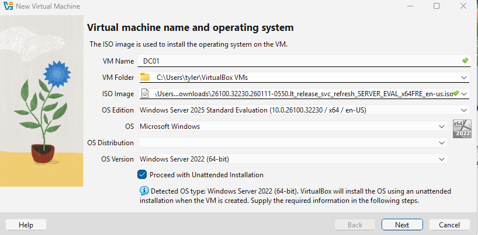
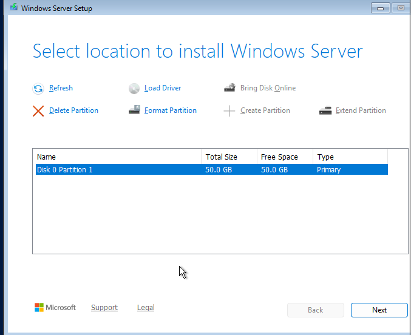
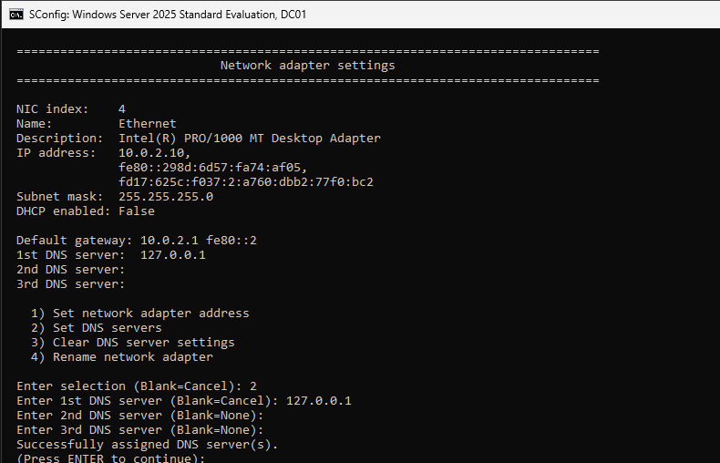
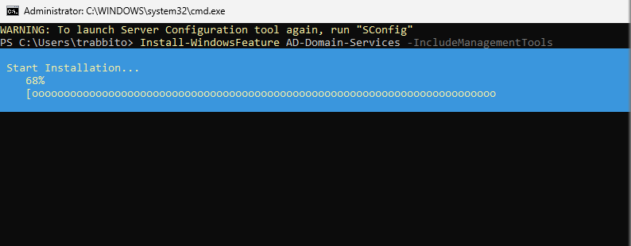
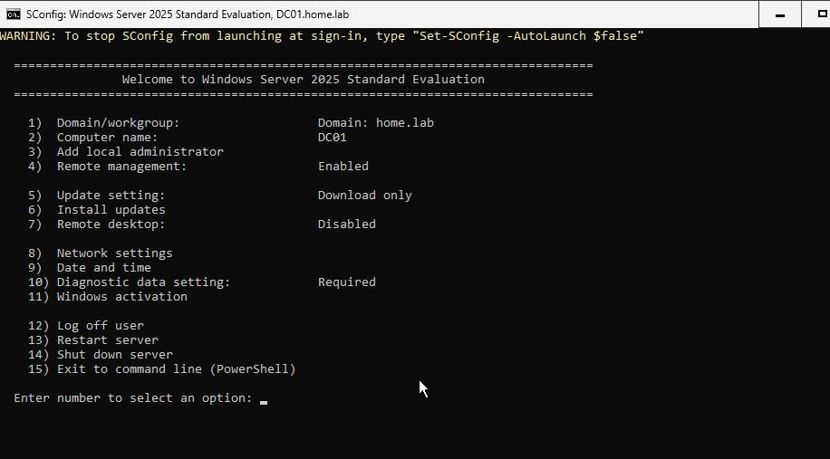
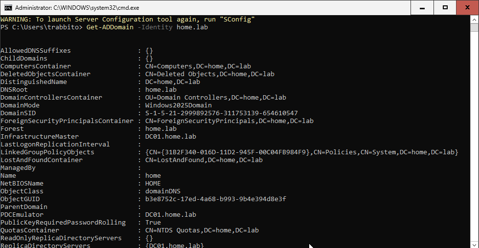

# Active Directory Lab Progress

* **Initial Setup (2026-06-16):**
  * VM (DC01) created with 4GB RAM, 2 CPUs, 50GB disk.
  * Windows Server 2025 Eval installed successfully.
  * 
  * 
  * **Troubleshooting:**
    * Encountered "Error selecting partition" during installation.
    * **Fix:** Deleted the existing partition and created a new one to re-initialize the disk as a basic partition.

* **Network Configuration:**
  * Assigned Static IP: 10.0.2.10
  * Set Primary DNS: 127.0.0.1 (Local loopback)
  * 

* **Role Installation:**
  * Installed AD-Domain-Services role via PowerShell.
  * Command: `Install-WindowsFeature AD-Domain-Services -IncludeManagementTools`
  * Status: Success.
  * 

* **Domain Promotion:**
  * Promoted server to Domain Controller for domain: `home.lab`
  * Command: `Install-ADDSForest -DomainName home.lab`
  * Status: Success. Server is now DC01.home.lab
  * 

* **Domain Controller Verification:**
  * **Objective:** Verify the Active Directory Domain Services installation and forest health via PowerShell.
  * **Command:** `Get-ADDomain -Identity home.lab`
  * **Result:** Successfully confirmed domain mode and infrastructure roles.
  * **Screenshots:**
    * 
    * 
    * 

* **Directory Structure Setup:**
  * **Objective:** Create an organized directory structure for lab resources using Organizational Units (OUs).
  * **Troubleshooting:**
    * Encountered "bad syntax" error in [Screenshot 2026-06-17 134032.png].
    * **Fix:** Corrected path syntax to use `DC=` and `,` correctly.
  * **Commands:**
```powershell
    New-ADOrganizationalUnit -Name "Labs" -Path "DC=home,DC=lab"
    New-ADOrganizationalUnit -Name "Users" -Path "OU=Labs,DC=home,DC=lab"
    New-ADOrganizationalUnit -Name "Workstations" -Path "OU=Labs,DC=home,DC=lab"
    ```
  * **Status:** Organizational Units (OUs) created successfully, establishing the following hierarchy: 
    * Labs (Root)
      * Users
      * Workstations

## Project Status
* **Status:** Paused (2026-06-17).
* **Summary:** Successfully deployed Windows Server 2025, promoted to Domain Controller, and configured core network/OU services. 
* **Reasoning:** Project paused to pivot focus towards Help Desk specific workflows, including ITSM ticketing systems and remote administration technical support.
